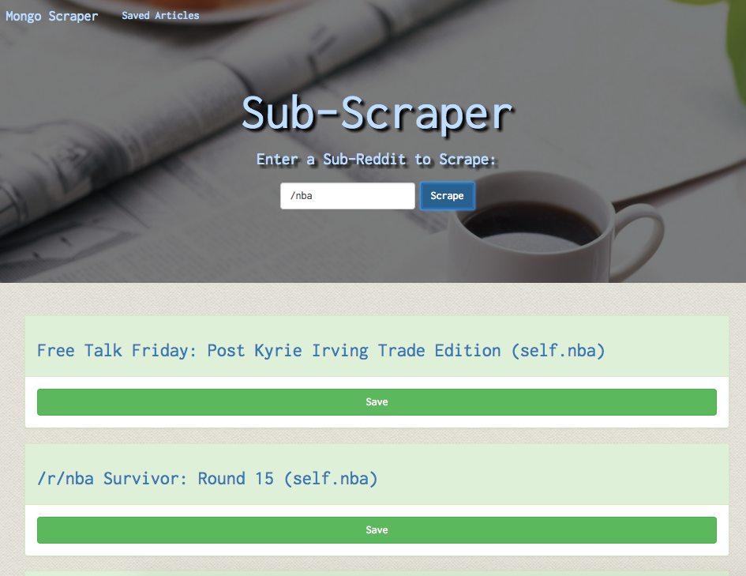
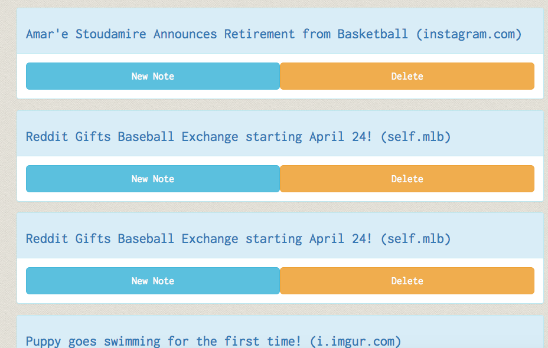
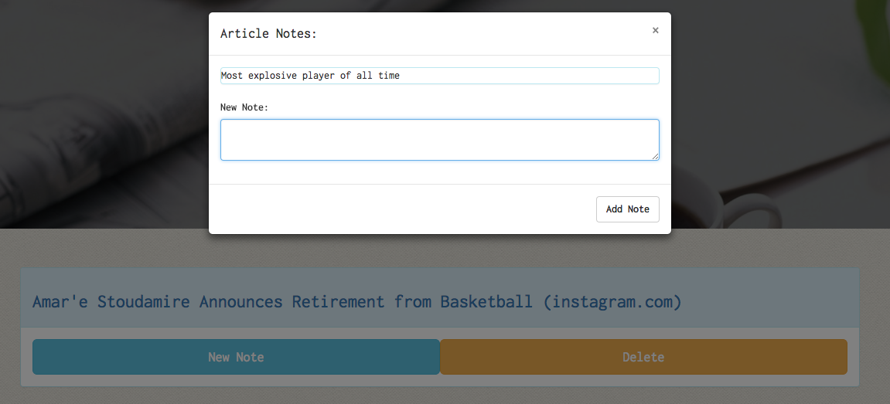

# Sub-Scraper

Link to the deployed Heroku application: https://safe-refuge-32666.herokuapp.com

## Description
***
This repository is a full MERN stack application that enables the user to: 

* Enter in a subreddit to scrape (as seen in the picture above)
* Choose links from the scraped results to save
* See a list of the saved links and add notes to each
* Delete links from the saved section

All of the data in this app persists through the MongoLab database heroku add-on. 

#### Contributors:
***

Casey Rubel [GitHub](https://github.com/caseyrubel)

#### Technologies Used:
***

* Javascript
* nodeJS
* Mongo/Mongoose
* Bootstrap
* Cheerio